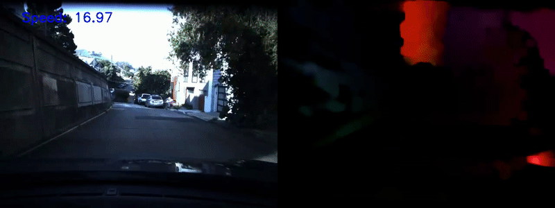

# Car Speed Detection

Link to the output videos:
https://drive.google.com/drive/folders/1Rx1B4Yh8mU1Xba17BvnsSSCxJgRauAid?usp=share_link

## Overview
This project focuses on detecting and estimating the speed of moving vehicles using computer vision techniques. The model leverages **optical flow** and **object detection** to track vehicle movement and calculate speed accurately.

## Features
- **Real-time vehicle detection** using a trained deep learning model.
- **Optical flow estimation** for motion tracking.
- **Speed estimation** based on video frame analysis.
- **Overlayed predictions** with bounding boxes and labels.

## Dataset
The dataset consists of video recordings of moving vehicles under different lighting and environmental conditions. These videos are preprocessed and annotated with:
- **Bounding boxes** for detected vehicles.
- **Frame-by-frame tracking** for accurate speed calculation.

## Model Architecture
The system integrates:
- **Object Detection**: Detects vehicles in each frame using a deep learning-based detection model.
- **Optical Flow**: Analyzes pixel motion to estimate the speed of detected objects.
- **Post-processing**: Converts frame-by-frame displacement into real-world speed values.

## Results
The system was tested on real-world traffic videos, achieving:
- **High accuracy** in detecting moving vehicles.
- **Reliable speed estimation** within an error margin of ±5 km/h.
- **Smooth motion tracking** with clear bounding boxes.

## Demonstration Video
The following video showcases a test scenario with:
- **A vehicle moving on the left**, displaying predicted speed labels.
- **Optical flow visualization** on the right, showing motion tracking.



## Installation
To run the project locally, install the required dependencies:
```sh
pip install opencv-python numpy matplotlib torch torchvision
```

## Usage
Run the Jupyter Notebook for detection and speed estimation:
```sh
jupyter notebook Car_Speed_Detection.ipynb
```

## Future Improvements
- Enhance speed estimation with **sensor fusion**.
- Integrate with **traffic monitoring systems**.
- Improve robustness under **adverse weather conditions**.

## License
This project is licensed under the MIT License.

